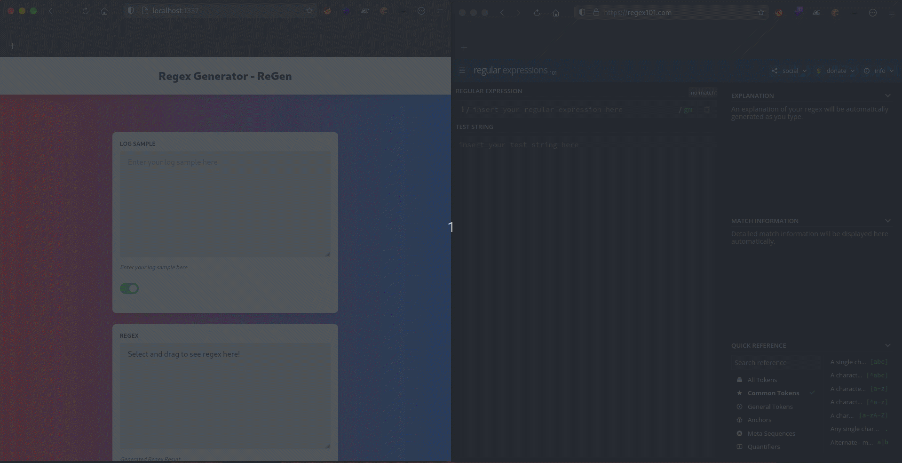

# ReGen - The Regular Expression Builder

[](https://creativecommons.org/licenses/by-nc/4.0/)
[](https://github.com/TheNittam/RPOscanner/)

## Overview

The ReGen is a utility tool that simplifies the process of crafting Regex expressions. With this tool, users can effortlessly generate Regex patterns by selecting desired values from logs or text. While it's still in its initial stages and may not be perfect, it aims to address the tediousness of Regex writing for various use cases, including digital forensics, attack, defense, and validation scenarios. By reducing the time spent on Regex creation, I hope to boost the overall work efficiency of professionals working with Regex.



## Features

- Select values from logs or text to automatically generate corresponding Regex expressions.
- Inspired by the efficient Grep & Extract feature of BurpSuite, making it user-friendly and intuitive.
- Simplify the process of crafting complex Regex patterns.

## Getting Started

To use the Regex Generator Tool locally, follow these steps:

1. **Clone the Repository:**
   Clone this repository to your local machine using your preferred version control tool or by downloading the ZIP file.

2. **Install Dependencies:**
   Open the terminal and run the following command to install the required dependencies:
   ```
   npm install
   ```

3. **Start the Tool:**
   After installing the dependencies, start the Regex Generator Tool by running the following command:
   ```
   npm run start
   ```

4. **Access the Tool:**
   Once the tool is up and running, open your web browser and navigate to [http://localhost:1337](http://localhost:1337).

5. **Input Your Log Sample:**
   On the tool's web page, enter your log sample into the provided textarea.

6. **Disable Textarea:**
   If need to disable the textarea by using the toggle button. This prevents accidental modifications to the log sample.

7. **Generate Regex Expressions:**
   Select the desired values from the logs or text within the textarea. The tool will automatically generate the corresponding Regex expressions based on your selection.

## Contributing

We welcome contributions from the community to make this tool even more powerful and robust. If you have any ideas, bug fixes, or feature suggestions, please feel free to open an issue or submit a pull request. Let's collaborate to simplify Regex writing for everyone!

## Roadmap

Our future plans for the Regex Generator Tool include:

- Enhancing the user interface for a more seamless experience.
- Adding support for additional log and text formats.
- Implementing advanced Regex generation algorithms.
- Integrating feedback and suggestions from users.

Stay tuned for more exciting updates!

## License

This project is licensed under the CC BY-NC 4.0 license.
